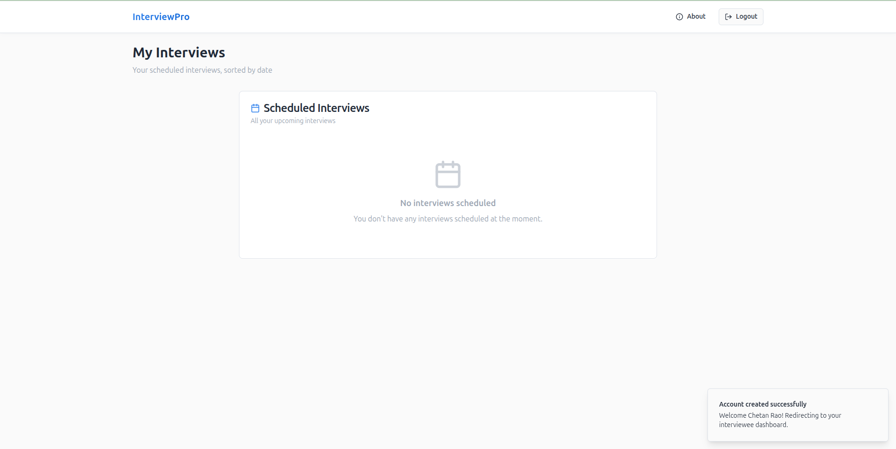
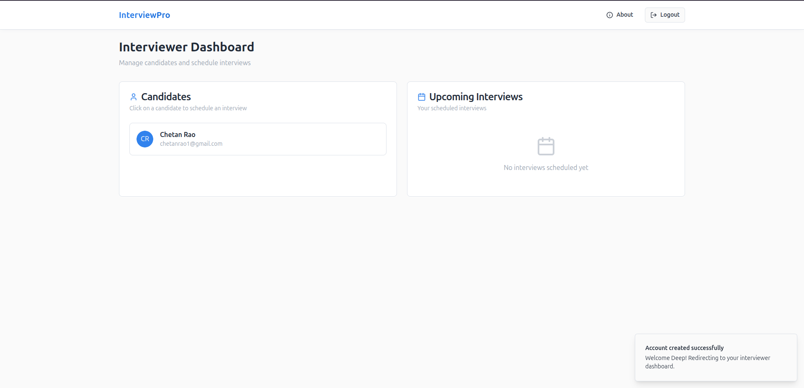
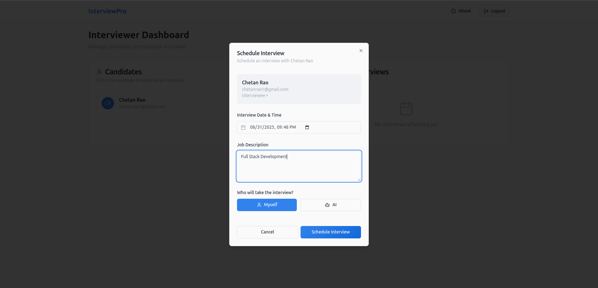
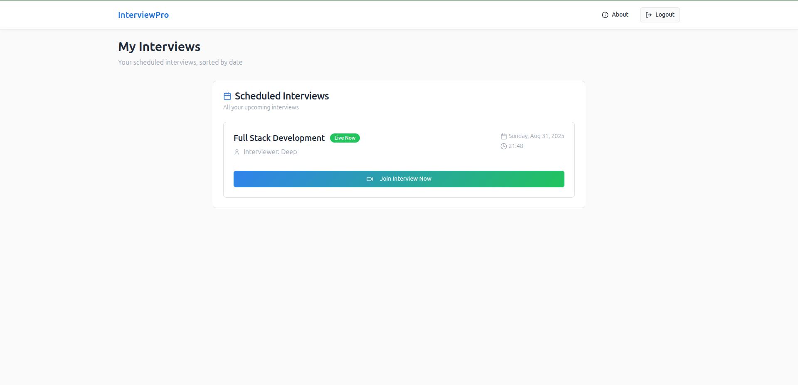
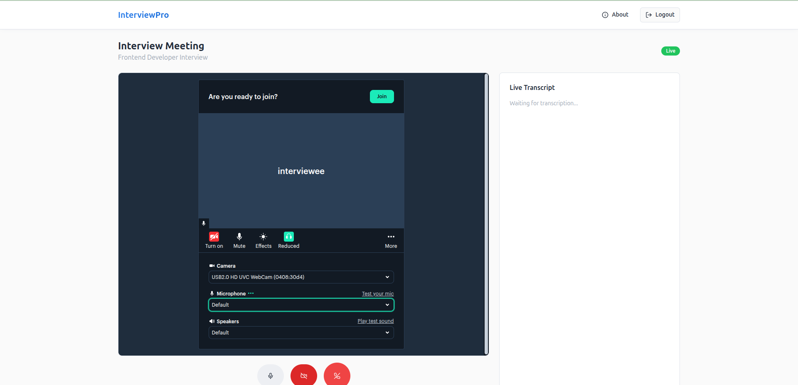
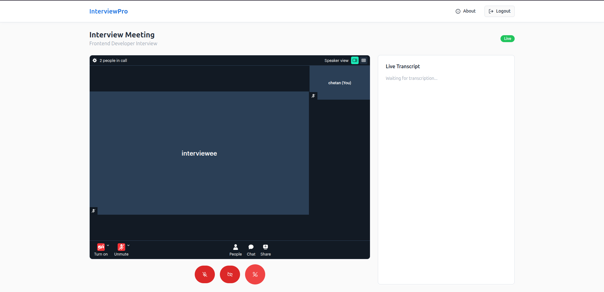
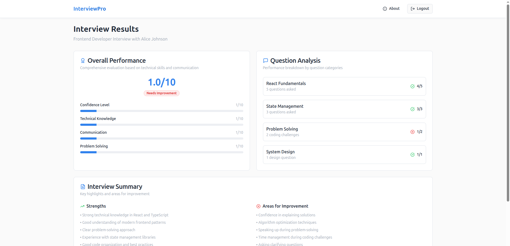
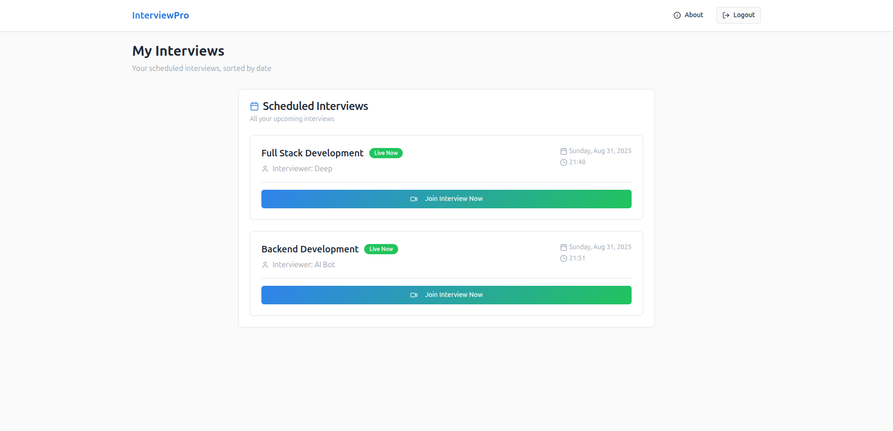
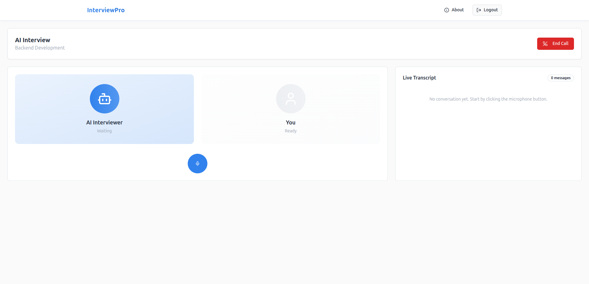

InterviewPro

InterviewPro is a full-stack MVP application designed to simplify and modernize the interview process for both interviewers and interviewees. It provides scheduling, real-time interviews (with AI or human interviewers), live transcriptions, and AI-generated interview results — all in one place.

✨ Features
👤 User Accounts

Interviewee can create an account.

Interviewer can create an account.

📋 Interview Management

Interviewers can view all registered interviewee profiles.

Interviewers can schedule interviews with:

Date & Time

Job Description

Choice of Interviewer → AI Agent or Human Interviewer

🎥 Interview Modes

Human Interviewer Mode:

Both interviewer and interviewee join a video call.

Live transcription is enabled during the call.

They can interact freely in real time.

AI Agent Mode:

The AI agent conducts the interview with the interviewee.

The interaction is fully automated.

📊 AI-Powered Results

After the interview, an AI agent analyzes the conversation.

Results are generated with insights into:

Confidence level

Technical knowledge

Communication skills

Problem-solving ability

Results are stored and accessible for review.

🚀 Tech Stack

Frontend: React + Vite + TailwindCSS + shadcn/ui

Backend: Node.js / Express

Database: MongoDB

Video Calls: Daily.co
 API (@daily-co/daily-js)

AI Features: Integrated agent for conducting interviews & result analysis

Live Transcription: Powered by AI speech-to-text

🛠️ Usage

Create an account as an interviewee or interviewer.

Schedule an interview:

Select the interviewee.

Pick date, time, and job description.

Choose AI agent or human interviewer.

Conduct the interview:

If human → join the video call with live transcription.

If AI → the AI agent handles the interview.

View results:

AI generates insights and scores based on the conversation.

📈 Roadmap

 Add email notifications for scheduled interviews.

 Support for multiple AI interview styles (technical, behavioral, HR).

 Export interview results as PDF.

 Integration with ATS (Applicant Tracking Systems).

Some Images for Ref

🤝 Contributing

Contributions are welcome! Please fork this repository and submit a pull request.

📜 License

This project is licensed under the MIT License.